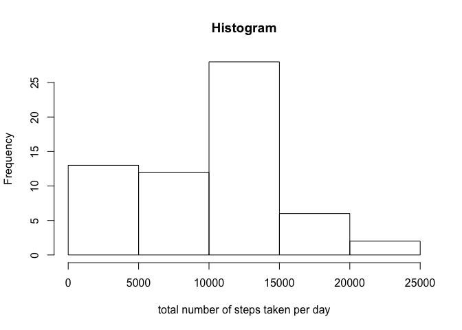
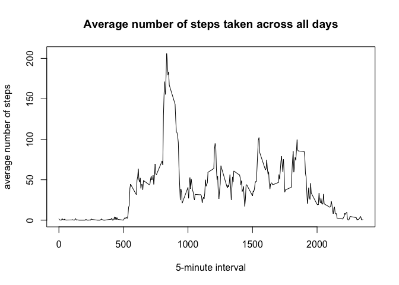
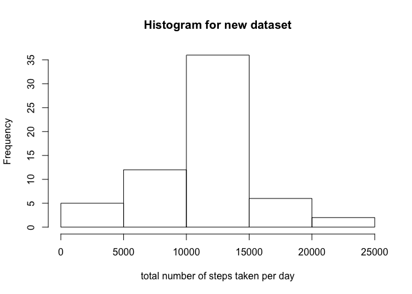
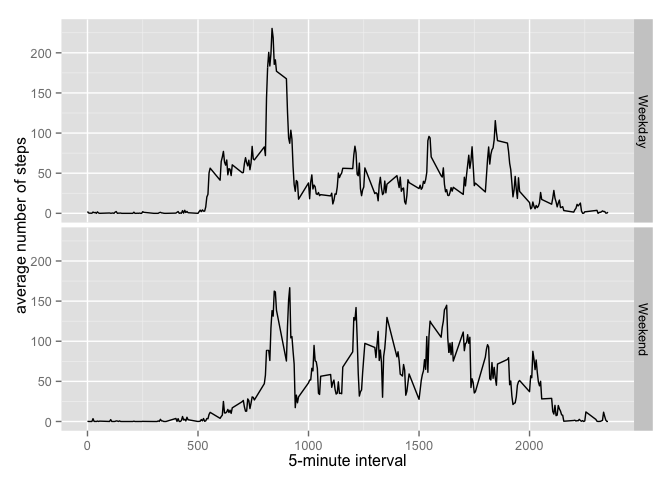

# Reproducible Research: Peer Assessment 1


## Loading and preprocessing the data


```r
AMD <- read.csv("./activity.csv", header=TRUE, na.strings = "NA")
summary(AMD)
```

```
##      steps                date          interval     
##  Min.   :  0.00   2012-10-01:  288   Min.   :   0.0  
##  1st Qu.:  0.00   2012-10-02:  288   1st Qu.: 588.8  
##  Median :  0.00   2012-10-03:  288   Median :1177.5  
##  Mean   : 37.38   2012-10-04:  288   Mean   :1177.5  
##  3rd Qu.: 12.00   2012-10-05:  288   3rd Qu.:1766.2  
##  Max.   :806.00   2012-10-06:  288   Max.   :2355.0  
##  NA's   :2304     (Other)   :15840
```


## What is mean total number of steps taken per day?

First, calculate the total number of steps taken per day:


```r
df <- AMD %>% 
    group_by(date) %>% 
    summarize(tot=sum(steps,na.rm=TRUE))

hist(df$tot, xlab="total number of steps taken per day", main="Histogram")
```

 

Then the stats on that:


```r
avg <- mean(df$tot)
med <- median(df$tot)
```

The mean and median of the total number of steps taken per day are 9354 and 10395 respectively.


## What is the average daily activity pattern?


```r
df <- AMD %>% 
    group_by(interval) %>% 
    summarize(avg=mean(steps,na.rm=TRUE))

plot(df$interval, df$avg, type="l", xlab="5-minute interval", ylab="average number of steps", 
     main="Average number of steps taken across all days")
```

 

The peak looks interesting:


```r
maxInterval <- df$interval[which.max(df$avg)]
```

835 is the 5-minute interval marker that contains the maximum number of steps (on average across all the days in the dataset).  This looks in line with the above plot.


## Imputing missing values


```r
nofNA <- sum(is.na(AMD$steps))
ratio <- nofNA / nrow(AMD)
```

The total number of missing values in the dataset is 2304, which is 13% of the whole dataset.

Filling the missing values with the the mean for the corresponding 5-minute interval:


```r
getAvg <-function(interval) {
    df$avg[df$interval==interval]    #df comes from the previous section
}
indexNA <- which(is.na(AMD$steps))
replacement <- sapply(AMD$interval[indexNA], getAvg)

AMD2 <- AMD    #creat new dataset
AMD2$steps[indexNA] <- replacement
summary(AMD2)
```

```
##      steps                date          interval     
##  Min.   :  0.00   2012-10-01:  288   Min.   :   0.0  
##  1st Qu.:  0.00   2012-10-02:  288   1st Qu.: 588.8  
##  Median :  0.00   2012-10-03:  288   Median :1177.5  
##  Mean   : 37.38   2012-10-04:  288   Mean   :1177.5  
##  3rd Qu.: 27.00   2012-10-05:  288   3rd Qu.:1766.2  
##  Max.   :806.00   2012-10-06:  288   Max.   :2355.0  
##                   (Other)   :15840
```

Let's look at the total number of steps taken per day again, and compare to the first part of the assignment:


```r
df2 <- AMD2 %>% 
    group_by(date) %>% 
    summarize(tot=sum(steps,na.rm=TRUE))

hist(df2$tot, xlab="total number of steps taken per day", main="Histogram for new dataset")
```

 

Note the histogram looks more balanced (not as skewed) now with missing values filled.


```r
avg2 <- mean(df2$tot)
med2 <- median(df2$tot)
```

For the new dataset, the mean and median of the total number of steps taken per day are 10766 and 10766 respectively.

These values differ from before, in fact both larger (and now equal).  This is a result of imputing missing values with replacement values that work out to be always positive.  In other words, adding data points with only positive values would increase both the mean and the median.


## Are there differences in activity patterns between weekdays and weekends?


```r
dayOfWeek <- weekdays(strptime(AMD2$date, format="%Y-%m-%d"))
AMD2$weekdayOrEnd[dayOfWeek %in% c("Monday","Tuesday","Wednesday","Thursday","Friday")] = "Weekday"
AMD2$weekdayOrEnd[dayOfWeek %in% c("Saturday","Sunday")] = "Weekend"
AMD2$weekdayOrEnd = factor(AMD2$weekdayOrEnd)

df2 <- AMD2 %>% 
    group_by(interval, weekdayOrEnd) %>% 
    summarize(avg=mean(steps,na.rm=TRUE))

qplot(interval, avg, data=df2, facets = weekdayOrEnd ~ ., geom="line", 
      xlab="5-minute interval", ylab="average number of steps")
```

 

The activity patterns look different: The peak is more pronounced on weekdays, but the average level of activity looks higher and more sustained on weekends.
